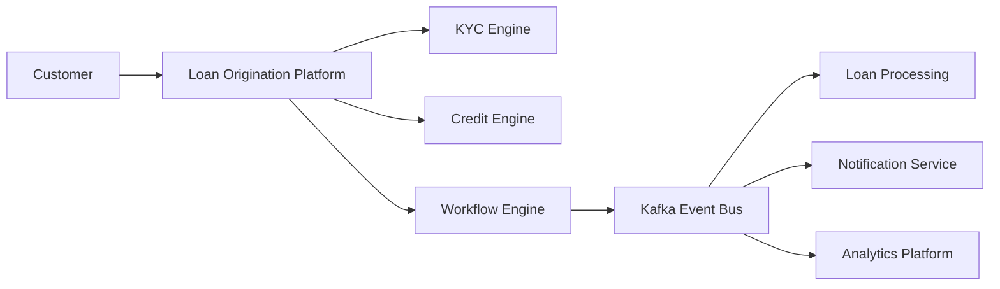
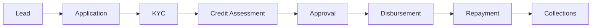

<div align="center">


<br>


<br><br>


</div>

---

# SYSTEM STATUS

<div align="center">

| Platform | Status |
|-----------|---------|
| Loan Origination Engine | 🟢 ONLINE |
| KYC Services | 🟢 ONLINE |
| Credit Decisioning | 🟢 ONLINE |
| Kafka Event Bus | 🟢 ONLINE |
| Redis Cache Layer | 🟢 ONLINE |
| API Gateway | 🟢 ONLINE |

</div>

---

# SYSTEM PROFILE

```yaml
Name: Prince Reshav
Role: Backend Engineer

Domain:
  - Financial Infrastructure
  - Lending Platforms
  - Workflow Automation

Primary Stack:
  - Java
  - Spring Boot
  - Kafka
  - Redis
  - PostgreSQL

Architecture:
  - Event Driven Systems
  - Distributed Services
  - CQRS
  - Saga Pattern
  - Domain Driven Design

Current Focus:
  - System Design
  - Scalable APIs
  - Workflow Engines
  - Fintech Infrastructure
```

---

# ABOUT

I design and build backend systems focused on lending workflows, onboarding pipelines, credit processing, and business process orchestration.

My interests extend beyond software development into the architecture of financial systems—how banks, payment networks, and lending platforms achieve consistency, reliability, auditability, and scale.

---

# FINANCIAL SYSTEM ARCHITECTURE



---

# LOAN LIFECYCLE



---

# TECHNOLOGY STACK

<div align="center">


</div>

---

# TECHNOLOGY RADAR

```text
JAVA                 ████████████████████ 95%
SPRING BOOT          ███████████████████░ 90%
KAFKA                ████████████████░░░░ 80%
REDIS                ███████████████░░░░░ 75%
POSTGRESQL           ████████████████░░░░ 80%
REACT                ██████████████░░░░░░ 70%
SYSTEM DESIGN        ███████████████░░░░░ 75%
FINTECH DOMAIN       █████████████████░░░ 85%
```

---

# FEATURED PROJECTS

| Project | Description |
|----------|-------------|
| 🏦 Loan Origination Platform | KYC, onboarding, credit decisioning, workflow orchestration, lending operations |
| 💳 GeoWallet | Digital wallet platform built using Spring Boot |
| 🏥 Patient Management System | Kafka-driven microservices platform with Redis caching |
| 🎬 Netflix Backend | Streaming platform backend architecture |

---

# LIVE SYSTEM LOG

```text
[INFO ] Kafka Broker Connected
[INFO ] Redis Cache Initialized
[INFO ] API Gateway Online
[INFO ] Loan Workflow Engine Started
[INFO ] Credit Decision Service Ready
[INFO ] Event Stream Processing Active
[INFO ] System Status: HEALTHY
```

---

# GITHUB ANALYTICS

<div align="center">


<br><br>


</div>

---

<div align="center">


</div>

---

# CONTRIBUTION MATRIX

<div align="center">


</div>

---

# CONNECT

<div align="center">

<a href="mailto:prince.reshav.5555@gmail.com">

</a>

<a href="https://linkedin.com/in/prince-reshav">

</a>

<a href="https://leetcode.com/u/user4357E">

</a>

</div>

---

<div align="center">

### Building Financial Infrastructure, One Service at a Time.

</div>
